# 🎨 Palette

## 📖 <a id= "descripcion"></a> Descripción

Palette es una aplicación web interactiva para la generación, exploración y gestión de paletas de colores.

La aplicación permite:

- Generar paletas aleatorias en formatos HSL y HEX.
- Elegir entre paletas de 6, 8 o 9 colores.
- Copiar colores individuales al portapapeles según el formato elegido (HSL o HEX).
- Copiar la paleta completa.
- Guardar hasta 5 paletas favoritas.
- Restaurar paletas previamente guardadas.
- Exportar la paleta actual como archivo descargable.
- Bloquear colores específicos para mantenerlos entre generaciones.
- Desbloquear todos los colores previamente bloqueados, tanto individualmente como en su totalidad.
- Persistir las paletas guardadas mediante LocalStorage.

---

## 📋 Índice

- [📖 Descripción](#descripcion)
- [🌐 Deploy](#deploy)
- [🚀 Instrucciones de uso](#instrucciones-de-uso)
- [💻 Ejecución local](#ejecucion-local)
- [📦 Despliegue](#despliegue)
- [⚙️ Decisiones técnicas](#decisiones-tecnicas)
- [🔮 Mejoras futuras](#mejoras-futuras)
- [🤖 Uso de Inteligencia Artificial](#uso-de-ia)
- [🎥 Flujo completo de la aplicación](#flujo-completo-de-la-aplicacion)
- [🛠️ Tecnologías utilizadas](#tecnologias-utilizadas)
- [✅ Validaciones](#-validaciones)
- [👨‍💻 Autor](#autor)
- [📄 Licencia](#licencia)


---

## <a id= "deploy"></a>🌐 Deploy

Puedes acceder a la aplicación desde cualquier navegador a partir del siguiente link:

🔗 **Deploy:**  
https://davirigoyen.github.io/ProyectoM1_DavidIrigoyen/

---

## <a id= "instrucciones-de-uso"></a>🚀 Instrucciones de uso

### Uso desde el navegador

1. Acceder al enlace de deploy.
2. Generar una nueva paleta mediante el botón correspondiente.
3. Seleccionar formato HSL o HEX.
4. Copiar colores individuales haciendo click sobre ellos.
5. Bloquear colores mediante el candado para conservarlos entre generaciones.
6. Guardar las paletas favoritas.
7. Restaurar o eliminar paletas guardadas.
8. Copiar o exportar la paleta completa.

---

## <a id= "ejecucion-local"></a> 💻 Ejecución local

### Requisitos previos

Antes de ejecutar el proyecto, asegúrate de tener instalado:

- Git
- Un navegador moderno (Google Chrome, Mozilla Firefox, Microsoft Edge, etc.)
- Visual Studio Code (opcional, recomendado)

---

### 1. Clonar el repositorio

Abrir una terminal y ejecutar:

```bash
git clone https://github.com/davirigoyen/ProyectoM1_DavidIrigoyen.git
```

---

### 2. Ingresar al directorio del proyecto

```bash
cd ProyectoM1_DavidIrigoyen
```

---

### 3. Abrir el proyecto

Puedes abrir el proyecto de dos maneras:

#### Opción A: Abrir directamente el archivo principal

Localizar y abrir:

```text
index.html
```

con cualquier navegador moderno.

---

#### Opción B: Utilizar Visual Studio Code

Abrir Visual Studio Code y seleccionar:

```text
Archivo → Abrir carpeta
```

Luego elegir la carpeta:

```text
ProyectoM1_DavidIrigoyen
```

---

### 4. Ejecutar con Live Server (recomendado)

Instalar la extensión:

```text
Live Server
```

desde el Marketplace de Visual Studio Code.

Luego:

1. Abrir el archivo `index.html`.
2. Hacer clic derecho sobre el archivo.
3. Seleccionar:

```text
Open with Live Server
```

El proyecto se abrirá automáticamente en el navegador predeterminado.

---

### 5. Verificar el funcionamiento

Una vez abierto el proyecto, deberían visualizarse:

- Los botones de generación de colores.
- El selector de formato HSL / HEX.
- El selector de cantidad de colores.
- Los botones para guardar, copiar y exportar paletas.
- El sistema de paletas guardadas.

La aplicación está lista para utilizarse sin necesidad de instalar dependencias adicionales.
---

## <a id= "despliegue"></a>📦 Despliegue

### GitHub Pages

1. Subir el proyecto al repositorio remoto.
2. Acceder a:

```text
Settings → Pages
```

3. Seleccionar:

```text
Branch: main
```

4. Seleccionar:

```text
Folder: /root
```

5. Guardar la configuración.
6. Esperar la publicación automática.
7. Acceder a la URL generada por GitHub Pages.

---

## <a id= "decisiones-tecnicas"></a>⚙️ Decisiones técnicas

### Diseño responsive

Se utilizaron unidades relativas como:

- rem
- vw
- vh
- clamp()

para lograr una correcta adaptación a diferentes resoluciones.

### Uso de variables para unidades

Se utilizaron variables integramente en todo el proyecto para que todas las unidades sean reutilizables en todo el proyecto y sean de utilidad para las mejoras futuras y de escalado de la aplicación.

### Validación CSS

Se incluyó en el proyecto el acceso a la validación CSS del mismo por parte de W3C.

### Restauración de Paletas guardadas

Se incluyó la funcionalidad de restauración de las paletas guardadas al render principal de la aplicación para que el usuario pueda reutilizarla para modificarla o exportarla directamente.

### Persistencia local

Se implementó LocalStorage para mantener las paletas guardadas entre sesiones sin necesidad de backend.

### Sistema de desbloqueo

Los colores de la paleta renderizada pueden desbloquearse todos al mismo tiempo para no tener que hacerlo en cada uno de los colores individualmente y así mejorar la velocidad en la interactividad de la aplicación para el usuario.

### Funciones en Java Script

Se utilizaron dos funciones principales y separadas de randomización de colores (una para HSL y otra para HEX) como núcleo de toda la lógica de JavaScript.

### Exportación

La aplicación permite exportar la paleta actual como archivo descargable generado desde el navegador.

### Gestión del estado

Se utilizó el atributo:

```html
data-bloqueado
```

como fuente principal del estado de bloqueo de cada color.

---

## <a id= "mejoras-futuras"></a>🔮 Mejoras futuras

### Funcionalidades previstas

- Extender su producción responsive a celulares y tablets.
- Revisar maquetado HTML y CSS para mejorar la aplicación según las mejores prácticas profesionales de desarrollo.
- Revisar y mejorar la accesibilidad en todos los detalles de la aplicación.
- Agregar validación de HTML.
- Compartir paletas mediante URL.
- Sistema de etiquetas para clasificar paletas.
- Búsqueda dentro de las paletas guardadas.
- Historial de generaciones anteriores.
- Modo oscuro.
- Animaciones avanzadas para interfaces y transiciones.
- Exportación de paletas en formato JSON para que otro programa la lea más facil y directamente.
- Exportación de paletas directa a variables CSS para que otro desarrollador pueda reutilizarlas directamente en su proyecto.
- Exportación de paletas a formato Adobe ASE para mejorar interrelación con productos Adobe para diseñadores.

---

## <a id= "uso-de-ia"></a> 🤖 Uso de Inteligencia Artificial

### Herramientas utilizadas

Durante el desarrollo del proyecto se emplearon herramientas de Inteligencia Artificial como apoyo para:

- Resolución de bugs.
- Refactorización de código.
- Optimización de lógica.
- Diseño de experiencia de usuario (UX).
- Generación de propuestas arquitectónicas.
- Mejora de la accesibilidad.
- Revisión y validación de decisiones técnicas.

### Inteligencias artificiales utilizadas

Durante el desarrollo del proyecto se utilizaron las siguientes Inteligencias Artificiales dependiendo de la asistencia requerida:

- Claude
- Google Gemini
- Copilot

### Tipo de asistencia recibida

La IA se utilizó como herramienta de apoyo técnico y consulta.

Todas las decisiones finales de implementación, integración y validación fueron realizadas por el desarrollador.

### Capturas de prompts relevantes

#### [Prompt 1](./docs/prompt-1.png)

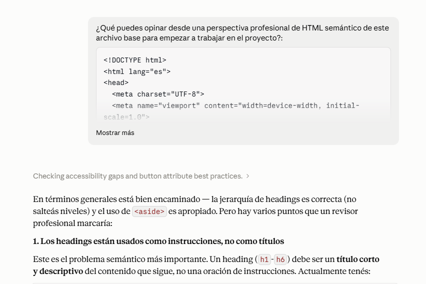

Prompt inicial para obtener respuesta sobre las buenas prácticas de maquetado HTML. Fue útil para organizar desde el inicio la estructura HTML de modo correcto y ordenado.

---

#### [Prompt 2](./docs/prompt-2.png)

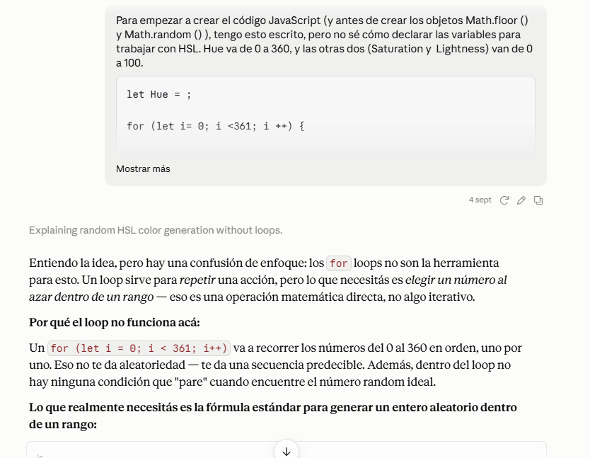

Prompt inicial para empezar el trabajo de randomización de colores en JavaScript. La respuesta obtenida ayudó a consolidar las funciones principales de obtención de colores aleatoria en las funciones de HSL y HEX.

---

#### [Prompt 3](./docs/prompt-3.png)

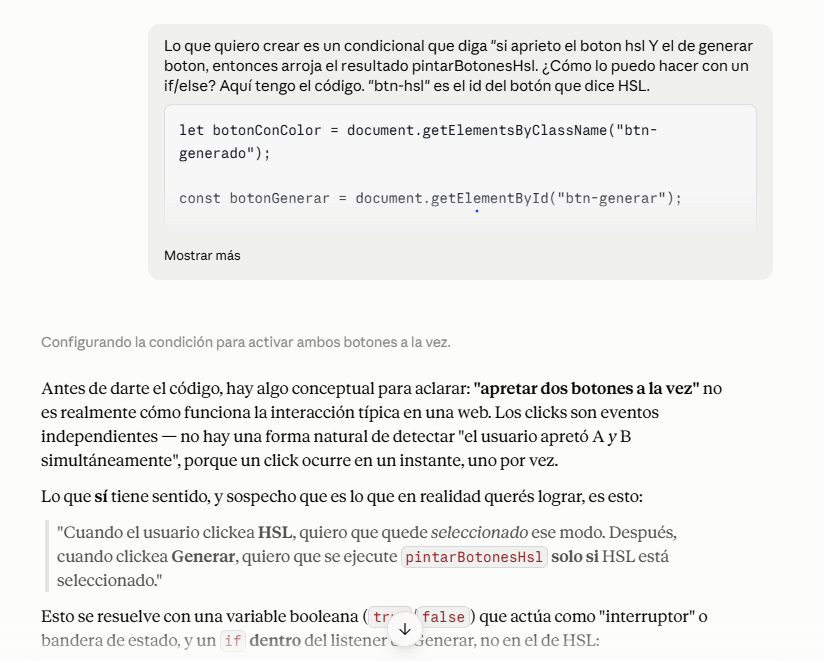

Prompt que ayudó a consolidar los modos HSL y HEX en el código de Java Script para el correcto funcionamento de la renderización y randomización de los colores dependiendo el formato elegido por el usuario.

---

#### [Prompt 4](./docs/prompt-4.png)

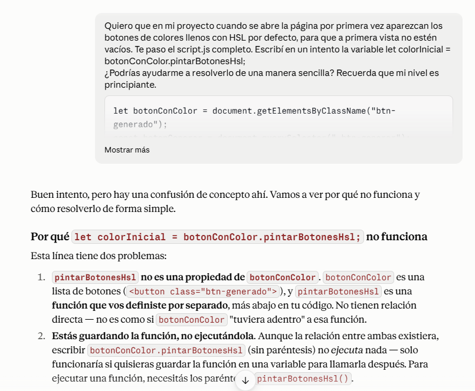

Prompt que ayudó a consolidar correctamente la relación entre las funciones y las variables. También ayudó a comprender la utilización del array para recorrer una lista de elementos al llamar a una clase, lo cual sirvió como guía para escribir el resto del código.

---

#### [Prompt 5](./docs/prompt-5.png)

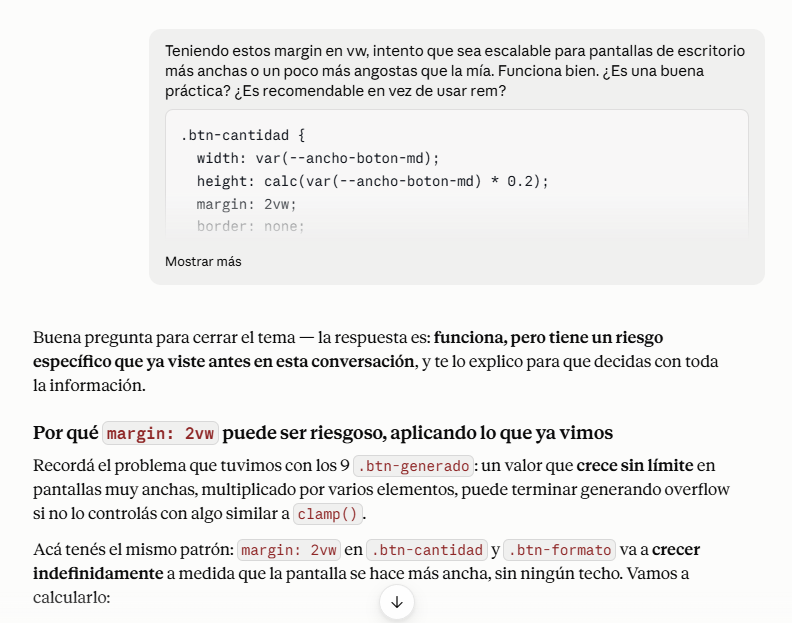

Prompt que ayudó a comprender y codificar el correcto responsiveness en Desktop de la Aplicación utilizando unidades como vw y vh.

---

#### [Prompt 6](./docs/prompt-6.png)

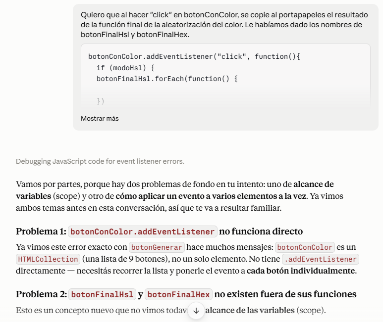

Prompt que ayudó a comprender el scope de las variables fuera de sus funciones y el desarrollo en el proyecto de los atributos html data-* en JavaScript que son la piedra angular de la arquitectura del código.

---

#### [Prompt 7](./docs/prompt-7.png)

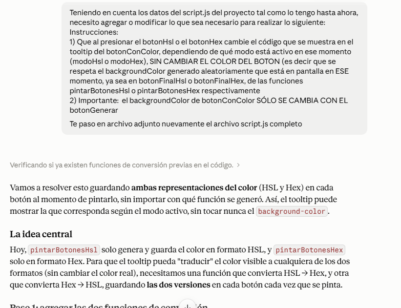
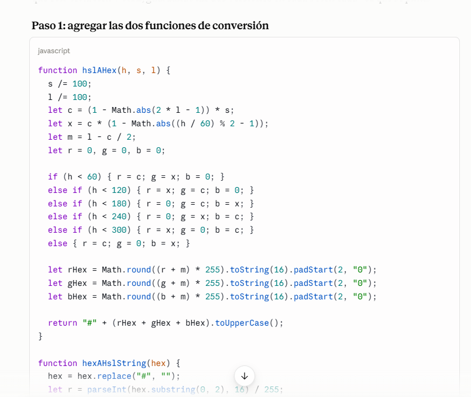

Prompt que ayudó a la conversión matemática de Hsl a Hex y viceversa que sirvió en todo el proyecto para distintas funcionalidades.

---

#### [Prompt 8](./docs/prompt-8.png)

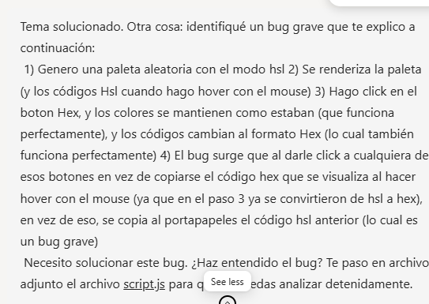
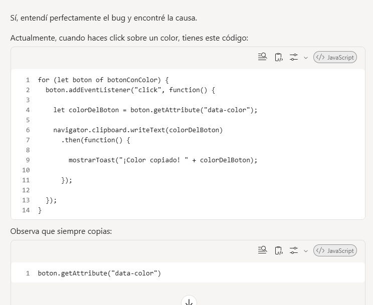

Prompt que ayudó a resolver un bug grave y que posteriormente sirvió para resolver otros bugs que se fueron detectando en la última etapa de producción de la aplicación.

---

## <a id= "flujo-completo-de-la-aplicacion"></a>🎥 Flujo completo de la aplicación

A continuación se muestra el flujo de uso de la aplicación:

### [Gif demostrativo](./docs/flujo-app.gif)

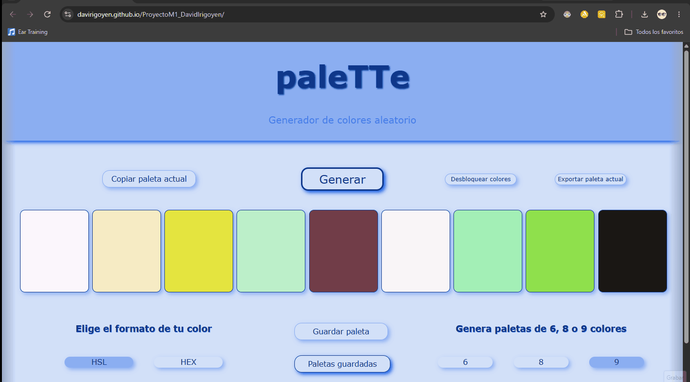

### Funcionalidades mostradas

- Generación de paletas.
- Cambio entre HSL y HEX.
- Bloqueo y desbloqueo de colores.
- Copia de colores.
- Copia de paletas.
- Guardado de paletas.
- Restauración de paletas.
- Eliminación de paletas.
- Exportación de paletas.
- Persistencia mediante LocalStorage.

---

## <a id= "tecnologias-utilizadas"></a> 🛠️ Tecnologías utilizadas

- HTML5
- CSS3
- JavaScript (Vanilla JS)
- Git
- GitHub
- GitHub Pages

---

## <a id= "validaciones"></a> ✅ Validaciones

Durante el desarrollo del proyecto se realizaron validaciones periódicas para verificar el cumplimiento de los estándares web y detectar posibles problemas de semántica, accesibilidad y sintaxis.

#### Validación HTML

La validación del marcado HTML se realizó utilizando el servicio oficial de W3C:

https://validator.w3.org/nu/

##### [Captura de validación HTML](./docs/validacion-html.png)

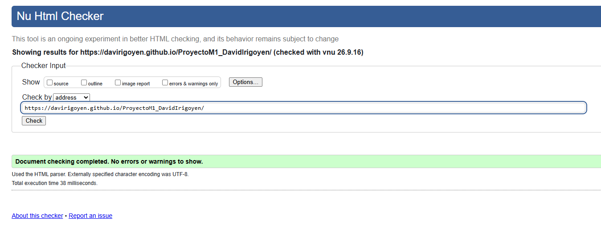

Se corrigieron errores de semántica en la utilización de las etiquetas: section, h2 y h3.

---

#### Validación CSS

La validación de las hojas de estilo se realizó utilizando el servicio oficial de W3C:

https://jigsaw.w3.org/css-validator/

##### [Captura de validación CSS](./docs/validacion-css.png)

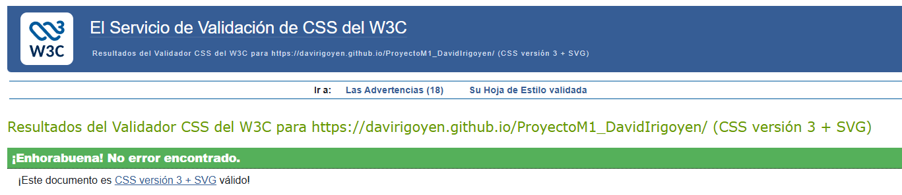

Se utilizó para chequear posibles errores de estilos en Css, aunque no se encontraron en los distintos chequeos durante la producción.

---

## <a id= "autor"></a>👨‍💻 Autor

**David Irigoyen**

- [GitHub](https://github.com/davirigoyen)
- [LinkedIn](https://www.linkedin.com/in/davidairigoyen/)

---

## <a id= "licencia"></a>📄 Licencia

Este proyecto fue desarrollado con fines educativos y de formación profesional.